# (Gradle) Hello World Application Demonstrating usage of Eclipse JKube for deploying onto Kubernetes


[](https://twitter.com/jkubeio)
[](https://github.com/eclipse/jkube)


> Note: This a demo project for [Eclipse JKube](https://github.com/eclipse/jkube) for a blog. You can find full blog here: [Introduction to Eclipse JKube Kubenretes & OpenShift Gradle Plugins]()

<p align="center">
  <a href="https://www.eclipse.org/jkube/">
  	
  </a>
</p>

This is a simple random number generation application which just generates a hello  string on `/` endpoint. It just
demonstrates usage of Eclipse JKube: https://github.com/eclipse/jkube

## Table of Contents:
* [How to Build](#How-to-build)
* [How to Run](#How-to-run)
* [Deploying on Kubernetes](#deploying-on-kubernetes)
* [Deploying on Red Hat OpenShift](#deploying-on-red-hat-openshift)

## How to build
Just run `gradle clean build`

## How to run
Do `java -jar build/libs/eclipse-jkube-demo-project-gradle-0.0.1-SNAPSHOT.jar
`

After spring boot initializes, just do a `curl localhost:8080/` to check endpoint.

## Deploying on Kubernetes

### Building Docker image

In order to build docker image of your application, you just have to make sure your docker deamon is running. If using
minikube, you can simply do `eval $(minikube docker-env)` to expose docker deamon running inside minikube vm. Now in
order to build simply issue:

> gradle k8sBuild

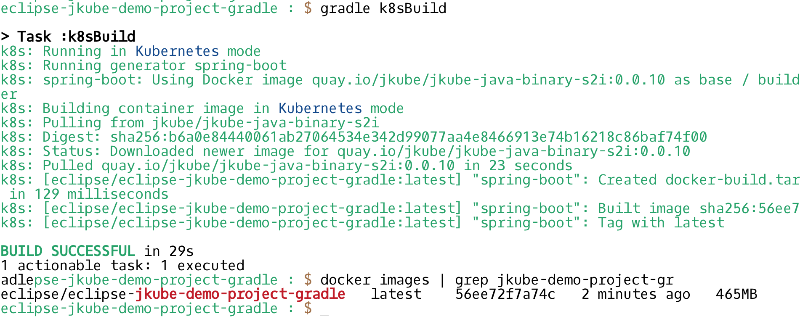

### Pushing your created Docker Image to some container registry

Make sure you have your image name configured with respect to the registry you want to push to. In this case I would be pushing
it to Docker Hub. I have added this property in `gradle.properties` file which overrides name of the Image being used:
```properties
jkube.generator.name = quay.io/rohankanojia/eclipse-jkube-demo-project-gradle:1.0.0
```
I have my registry setting being defined in my `~/.docker/config.json` by doing docker login:
```sh
eclipse-jkube-demo-project-gradle : $ docker login quay.io
Username: rohankanojia
Password: 
WARNING! Your password will be stored unencrypted in /home/rokumar/.docker/config.json.
Configure a credential helper to remove this warning. See
https://docs.docker.com/engine/reference/commandline/login/#credentials-store

Login Succeeded
```
> gradle k8sPush


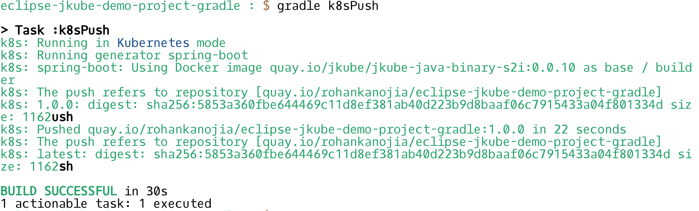
Once pushed you can see your image being pushed to Docker registry like this:

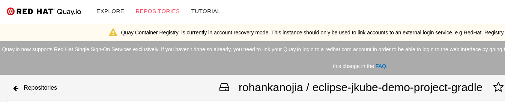

### Generating Kubernetes Manifests

Once your image is built, you need to generate Kubernetes resource manifests for your Deployments, Service etc. To do
it using Eclipse JKube Kubernetes Gradle Plugin just do:

> gradle k8sResource

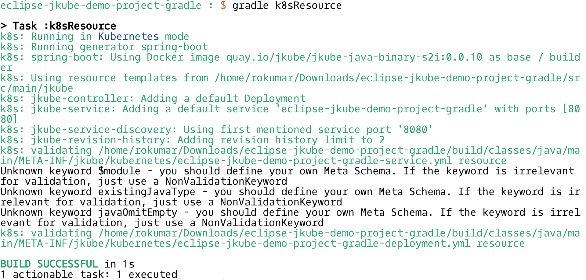

### Deploying application onto Kubernetes

In order to deploy these generated manifests onto Kubernetes, just issue:

> gradle k8sApply

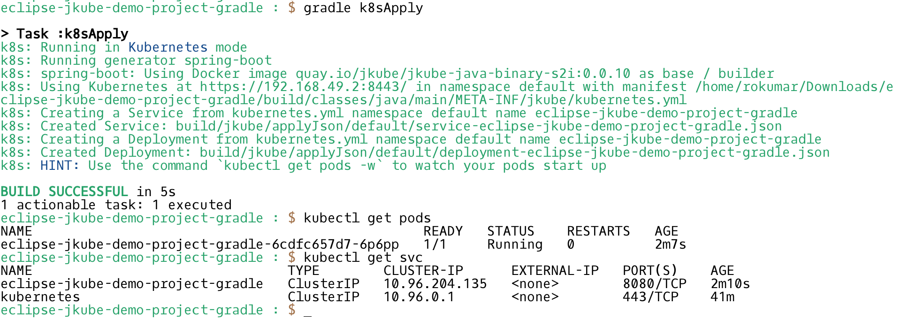

You'd observe they would be applied onto your Kubernetes Cluster. Right now Eclipse JKube has created a `Deployment` and a `Service` based on opinionated defaults. By default `Service` created is of type `ClusterIP`, which means it's only accessible from within the Kubernetes Cluster. That's why you see there is an ssh into minikube for accessing endpoint. If you want to access your application from outside the cluster you have to tell plugin to create service of type `NodePort` by specifying this property:
```properties
jkube.enricher.jkube-service.type = NodePort
```
After that you can notice that `gradle k8sResource` goal would generate `Service` of type `NodePort`. Here is how it would look like in action:

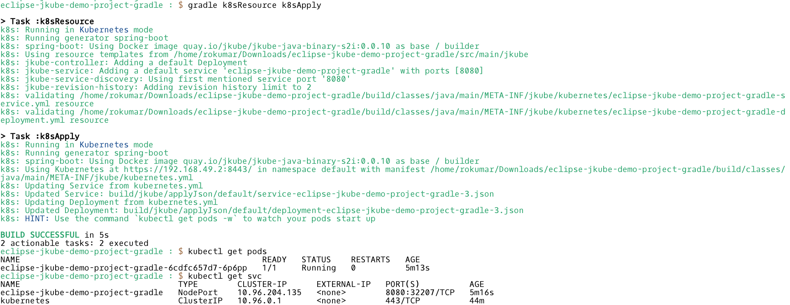


### CleanUp: Un-deploy your application from Kubernetes cluster

If you want to un-deploy, we have this goal to delete all resources applied.

> gradle k8sUndeploy

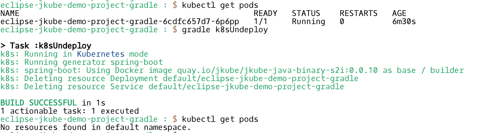

## Deploying on Red Hat OpenShift
[Red Hat OpenShift](https://www.openshift.com/) is Red Hat's official distribution of Kubernetes which empowers developers to innovate and ship faster with the leading hybrid cloud, enterprise container platform.

We would also be taking a look into how [Eclipse JKube OpenShift Gradle Plugin](https://www.eclipse.org/jkube/docs/openshift-gradle-plugin) can be used to deploy this random generator application on top of Red Hat OpenShift.

You can add it as a dependency in your project's `pom.xml` like this:
```groovy
plugins {
  id 'org.eclipse.jkube.openshift' version '1.5.1'
}
```

It's already added inside this project's `build.gradle`. So let's start by logging into our OpenShift cluster:
```
~/work/repos/eclipse-jkube-demo-project : $ oc login https://api.rh-idev.openshift.com --token=mytoken
Logged into "https://api.rh-idev.openshift.com:443" as "rohanKanojia" using the token provided.

You have one project on this server: "rokumar"

Using project "rokumar".
```

### Doing an S2I based build
OpenShift has a really nice [Source-to-image(S2I)](https://docs.openshift.com/container-platform/3.9/creating_images/s2i.html#creating-images-s2i) framework which eases writing images by just providing application source code as an input. Note that you would need to comment out `jkube.generator.name` property that we added during docker build in order to use this. OpenShift Gradle Plugin relies on this for build process. Here is how it would look:
> gradle ocBuild

>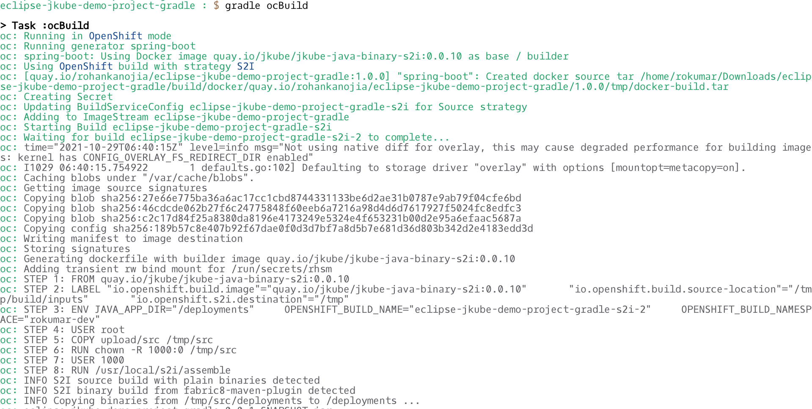

Once build is complete you can see `BuildConfig` being created, OpenShift build process takes care of building and pushing the image to OpenShift's internal container registry:
```
oc: Pushing image image-registry.openshift-image-registry.svc:5000/rokumar-dev/eclipse-jkube-demo-project-gradle:1.0.0 ...
oc: Getting image source signatures
oc: Copying blob sha256:3d50bd3a6769cbedb4b4181d75f5a339038825ec12979cff2ec2a210b24c73e4
oc: Copying blob sha256:27e66e775ba36a6ac17cc1cbd8744331133be6d2ae31b0787e9ab79f04cfe6bd
oc: Copying blob sha256:46cdcde062b27f6c24775848f60eeb6a7216a98d4d6d7617927f5024fc8edfc3
oc: Copying blob sha256:c2c17d84f25a8380da8196e4173249e5324e4f653231b00d2e95a6efaac5687a
oc: Copying config sha256:1e7735bc4ce7fa00373a63d655c8f0620fc35caaa3ad97277848d0a5e2724795
oc: Writing manifest to image destination
oc: Storing signatures
oc: Successfully pushed image-registry.openshift-image-registry.svc:5000/rokumar-dev/eclipse-jkube-demo-project-gradle@sha256:9a4310fd2fda78a416e139db2da0e0868e955b7a492f6a849952fb4e6e3093b4
oc: Push successful
oc: Build eclipse-jkube-demo-project-gradle-s2i-2 in status Complete
oc: Found tag on ImageStream eclipse-jkube-demo-project-gradle tag: sha256:9a4310fd2fda78a416e139db2da0e0868e955b7a492f6a849952fb4e6e3093b4:ocBuild
oc: ImageStream eclipse-jkube-demo-project-gradle written to /home/rokumar/Downloads/eclipse-jkube-demo-project-gradle/build/eclipse-jkube-demo-project-gradle-is.yml

BUILD SUCCESSFUL in 1m 25s
1 actionable task: 1 executed
eclipse-jkube-demo-project-gradle : $ 
eclipse-jkube-demo-project-gradle : $ oc get pods
NAME                                            READY     STATUS      RESTARTS   AGE
eclipse-jkube-demo-project-gradle-s2i-2-build   0/1       Completed   0          3m10s
eclipse-jkube-demo-project-gradle : $ oc get bc
NAME                                    TYPE      FROM      LATEST
eclipse-jkube-demo-project-gradle-s2i   Source    Binary    2
eclipse-jkube-demo-project-gradle : $ oc get build
NAME                                      TYPE      FROM      STATUS     STARTED         DURATION
eclipse-jkube-demo-project-gradle-s2i-2   Source    Binary    Complete   3 minutes ago   1m14s
```

### Generating Red hat OpenShift manifests
Generating OpenShift manifests is not very different from generating Kubernetes manifests. Only `DeploymentConfig` is used in place of `Deployment`. Here is demonstration of `oc:resource` goal:

> gradle ocResource

>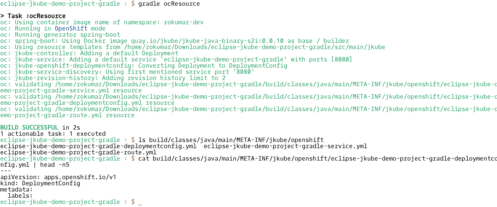

### Applying Generated manifests onto Red Hat OpenShift cluster

> gradle ocApply

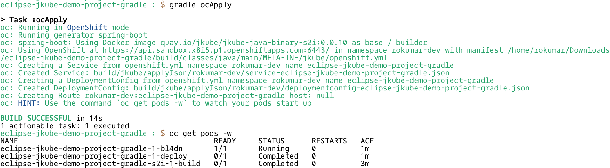

Once deployed you can see your application inside OpenShift console:

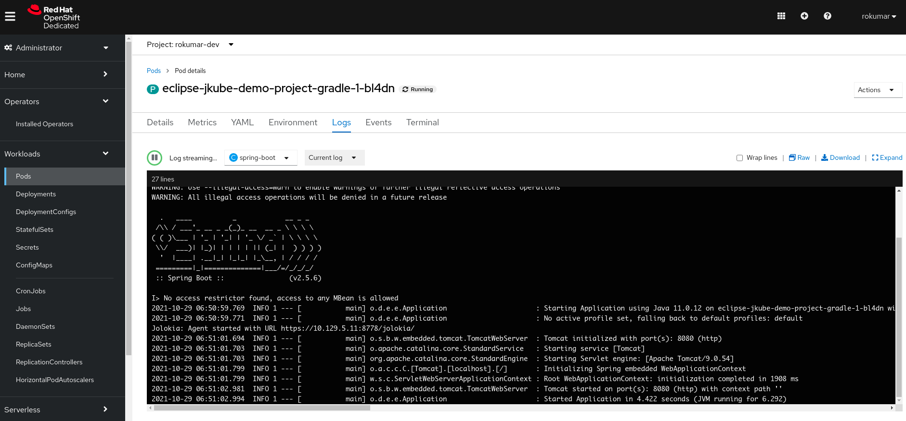

You can then try to access your application via the created `Route`:
```sh
$ oc get pods
NAME                                            READY     STATUS      RESTARTS   AGE
eclipse-jkube-demo-project-gradle-1-bl4dn       1/1       Running     0          3m17s
eclipse-jkube-demo-project-gradle-1-deploy      0/1       Completed   0          3m19s
eclipse-jkube-demo-project-gradle-s2i-1-build   0/1       Completed   0          5m24s
$ oc get routes
NAME                                HOST/PORT                                                                              PATH      SERVICES                            PORT      TERMINATION   WILDCARD
eclipse-jkube-demo-project-gradle   eclipse-jkube-demo-project-gradle-rokumar-dev.apps.sandbox.x8i5.p1.openshiftapps.com             eclipse-jkube-demo-project-gradle   8080                    None                                                                            eclipse-jkube-demo-project-gradle-rokumar-dev.apps.sandbox.x8i5.p1.openshiftapps.comr-dev.apps.sandbox.x8i5.p1.openshiftapps.com
$ curl eclipse-jkube-demo-project-gradle-rokumar-dev.apps.sandbox.x8i5.p1.openshiftapps.com
Hello JKube!
```
